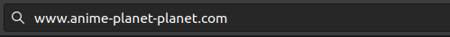

# How do Web Browsers Work

Web browsers are one of the most widey used software in the world.The main function of the browser is to display the resource that you have requested(be it an HTML document,an PDF, or some other type of content.Let’s see what happens when you type `http://www.anime-planet.com` in the address bar.



## High level structure of a browser

- ********\*\*********\*\*\*\*********\*\*********The User Interface:********\*\*********\*\*\*\*********\*\********* This contains all of the components that the user can see on a browser, like the address bar, the menu, bookmark tab etc.
- ******\*\*******\*\*******\*\*******Browser Engine:******\*\*******\*\*******\*\******* Acts as a middle layer between UI and rendering engine.
- ******\*\*\*\*******\*\*\*\*******\*\*\*\*******Rendering Engine:******\*\*\*\*******\*\*\*\*******\*\*\*\******* Creates the DOM tree structure , parses HTML , CSS and renders the parsed content onto the screen. Different browsers use different rendering engines: Internet Explorer uses Trident, Firefox uses Gecko, Safari uses WebKit. Chrome and Opera (from version 15) use Blink, a fork of WebKit.
- ****\*\*****\*\*****\*\*****Networking:****\*\*****\*\*****\*\***** For network calls.
- ****\*\*****\*\*\*\*****\*\*****UI backend:****\*\*****\*\*\*\*****\*\***** Draws widgets like combo box and windows,
- **\*\*\*\***Javascript Interpreter:**\*\*\*\*** Parses and executes Javascript code.
- ****\*\*\*\*****\*\*\*\*****\*\*\*\*****Data Storage:****\*\*\*\*****\*\*\*\*****\*\*\*\***** Storage mechanism like cookies , localStorage , sessionStorage Indexed DB etc.
  

## Networking

Networking starts when the user enters a URL in the address bar and submit/presses enter.

### DNS Lookup

- The first step of navigating to a web page is finding where the assets for the web page are located.If you have never visited a site,DNS lookup takes place and if you have, then the address’ IP is cached which speeds up subsequent requests.DNS lookup responds with an IP.

.png>)

### TCP Handshake

Once the IP address is known a TCP handshake takes place between the Browser and the web server.This handshake determines which cipher will be used to encrypt the communication, verfied whether the server is secure before beginning the transfer of data

### Response

Once connection is established, the browser sends an initial GET request on behalf of the user,the server replies with the HTML document.

## The Rendering Engine

- The rendering engine will start receiveing the contents of the requested document from the networking layer in 8kb packs.
- Then, it will start **parsing** the html and convert the different elements into DOM nodes and create a ****\*\*\*\*****\*\*****\*\*\*\*****content tree.****\*\*\*\*****\*\*****\*\*\*\*****
- The engine will parse the style data, both external css files and in style elements and create a ****\*\*****\*\*\*\*****\*\*****render tree.****\*\*****\*\*\*\*****\*\*****
- Then the render tree goes through a process of **\*\***\*\***\*\***layout**\*\***\*\***\*\*** process. The means giving each node its exact size and placement of where it should appear on the [screen. Next](http://screen.Next), the UI backend layer comes into play and each node will be **painted** onto the screen.

.png>)

### Parsing

Parsing a docuemnt means converting it to structure the code can use.The result of the parsing is a tree like structure made up of Nodes that represent structure of the document. This is called a \***\*Parse Tree\*\*** or a **\*\***\*\***\*\***Syntax tree.**\*\***\*\***\*\***

Parsing consists of two seperate processes: lexical analysis and syntax analysis

- \***\*Lexer\*\*** breaks the input into tokens.These tokens are a collection of valid building blocks.The parser knows to strip irrelevant characters like white spaces and line breaks.
- \***\*Sytax\*\*** analysis applies the relevant language rules to the tokens.

The parser will ask the lexer for a token and try to match it with a syntax rule.If no rule matches , then the token is stored .If it does, then the token is added as a new node to the syntax tree.All the nodes stored internally will be matched with rules.If these nodes do not match rules,the parser raises an Syntax error exception.

Generally,the parsed tree is not the final product.Parsing is used in \***\*translation\*\***. That is, converting the given input to another format.An example is compilation.The HTML parser parses the HTML markup into the **\*\*\*\***DOM Tree.**\*\*\*\***

The DOM is a tree like structure of HTML elements and attributes.This is language independent and acts as a interface between JavaScript and HTML.The tree is constructed in a top down approach and there is 1:1 mapping between an html element and the Dom tree node.

```jsx
<html>
  <body>
    <p>Hi There</p>
    <div>
      {" "}
      
    </div>
  </body>
</html>
```

.png>)

Tokenization is the lexical analysis.During HTML tokenization,the tokenizer recognizes the HTMl token(start tag,end tags,html elements tags, attribute names etc.) and pases the token onto a \***\*Tree construtor\*\***.This continues until the end of the input is reached.


The input to the tree construction stage is a sequence of tokens from the tokenization stage. Receiving the "html" token will cause a move to the **"before html"**
mode and a reprocessing of the token in that mode. This will cause
creation of the HTMLHtmlElement element, which will be appended to the
root Document object.

### CSS Parsing

The CSS object model is similar to the DOM. The DOM and CSSOM are both trees. They are independent data structures.


### JavaScript Compilation

While the CSS is being parsed and the CSSOM created, other assets,
including JavaScript files, are downloading (thanks to the preload
scanner). JavaScript is interpreted, compiled, parsed and executed. The
scripts are parsed into abstract syntax trees

### Render Tres Construction

The DOM Tree and CSSOM are combined to form the Render tree

The nodes in the renderer correspond to the DOM Elements.But the relation is not 1:1.Non-visual DOM elements will not be inserted into the render tree.


## Layout

After the render tree is contructed,runnning of layout on the render tree is done to computer the geometry of each node.**L*ayout*** is the process by which the width, height, and location of all the nodes in the render tree are determined, plus the determination of the size and position of each object on the page.

## Paint

The last step is painting.In this step the browser converts each each box calculated in the layout phase to actual pixels on the screen.Painting involves drawing every visual part of an element to the screen, including text, colors, borders, shadows, and replaced elements like buttons and images.alculated box from the layout phase to actual pixels on the screen
